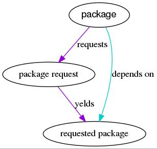

# Short notes on npmjs.scm


Every dependency is represented in the graph as in this picture



This is because nodejs packages declare dependencies with version numbers as, for example

\^1.4.0

~1.4.0

~1.4

1.4.0

1.4.x

1.4


and so on. The ways are endless

So I store the unpredictable pakage request and this produces the "package request" node and the "requests" edge. 

Then I issue the request to registry.npms.com and I store the even more unpredictably yelded pakage (the "yelds" edge and the "depends-on" edge)

In the following iterations, should the same request be encountered, I can avoid redownloading the same package.

Too bad, should a _different_ request yeld the same pakage, that will have to be downloaded again, because I can't know that in advance :-/

This might seem exagerated, but it's not. Downloads are sloooooooow and after hours of waiting you kinda resent the fact that the same package has to be downloaded over and over again.

Now, the current problem is that sometimes the graph printing stops because some package or request node vertices havo NO outgoing edges. And no incoming edges :-/

On another side, thhere are NO edges without start or end

I don't understand what's going on

For details, see the comments on line 284 of npmjs.scm

# Culturia


Culturia is an intelligence augmentation software.

The name is a reference to
[Culture and Empire by Pieter Hintjens](http://cultureandempire.com) and
[Intelligence Augmentation](https://en.wikipedia.org/wiki/Intelligence_amplification).

## Roadmap

Create a framework that makes it easy to tape into NLP algorithm and provide an
interface for common tasks.

## Getting started

### Ubuntu and others

Install wiredtiger develop branch and that is all.

### guix and guixd

Use the following command starting from the git repository:

```bash
culturia $ guix build -f guix.scm
culturia $ patch -p1 < guix-wiredtiger.diff
culturia $ guix environment --ad-hoc --pure guile-next
culturia $ cd src
culturia/src $ CHECK=t guile -L . grf3.scm 
culturia/src $ CHECK_WSH=t guile -L . wsh.scm
```

## Files

Source files can be found in `src` directory.
Documentation can be found in `doc` directory.

## Contact

[Say héllo!](mailto:amirouche@hypermove.net)
